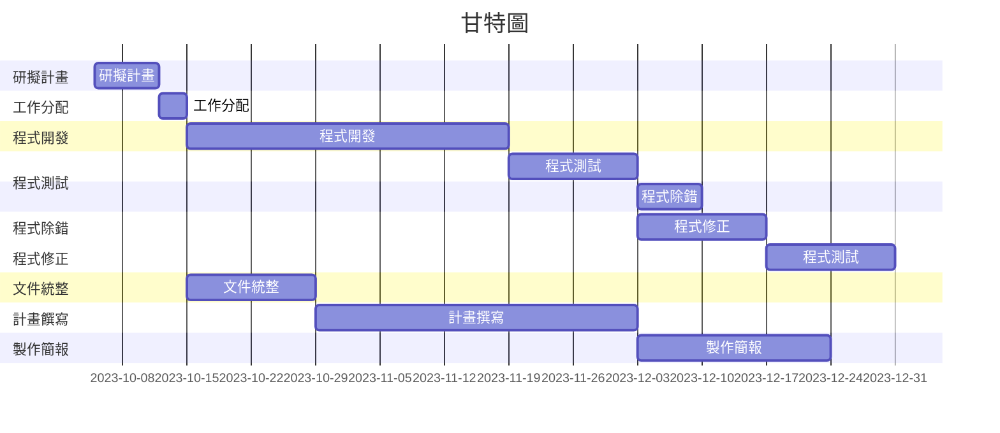

# 專題名稱 : discord機器人
# 小組成員 (組長)
|職位|學號|名字|
|:--:|:--:|:--:|
|組長|C110118217|林盛凱|
|組員|C110118201|謝政斈|
|組員|C110118207|葉力誠|
|組員|C110118243|陳以嘉|
|組員|C110118228|陳逸凱|

# 專題簡介 (300字以上)
##Discord機器人製作是一個引人入勝的主題，這個專題旨在探討如何設計、開發和定制您自己的Discord機器人，以滿足各種不同需求和用途。Discord是一個廣泛使用的即時通訊平台，特別在遊戲社區和虛擬聚會中非常受歡迎。機器人的加入為這個平台帶來了更多的互動性、功能和樂趣，因此掌握如何創建和定制機器人是一個令人興奮的技能。

在這個專題中，我們將深入探討Discord機器人的製作過程，包括以下關鍵內容：

機器人的基本概念： 我們將解釋什麼是Discord機器人，以及它們如何在Discord伺服器中發揮作用。您將了解機器人的基本結構和功能，以及如何設計機器人以滿足您的需求。

開發工具和環境： 我們將介紹您需要的開發工具，包括程式語言選擇（通常使用Python、JavaScript等）、Discord API文檔的使用，以及如何設置開發環境。

創建您的機器人： 我們將逐步創建自己的Discord機器人。從註冊機器人帳號、獲取API金鑰，到編寫機器人的代碼。

功能和應用： 我們將討論不同種類的Discord機器人，包括娛樂性機器人、管理機器人、音樂機器人等。您將了解如何為這些機器人添加各種功能，並瞭解它們在不同情境中的應用。

部署和維護： 我們將解釋如何將您的機器人部署到Discord伺服器，以及如何維護和更新機器人以確保其順利運行。

安全性考慮： 我們將討論有關機器人安全性的重要考慮，以確保您的機器人不會受到濫用或遭受攻擊。

# 工作任務

| 姓名 | 工作內容 |
| :-: | :-: |
| 葉力誠 | 程式開發及撰寫 |
| 謝政斈 | 程式開發及撰寫 |
| 陳逸凱 | 規劃目標及撰寫計畫書 |
| 陳以嘉 | 文件整理和統整 |
| 林盛凱 | 軟體測試並除錯 |

# 專題甘特圖與PERT/CPM圖

## 關鍵路徑
1->2->3->5->6->7
