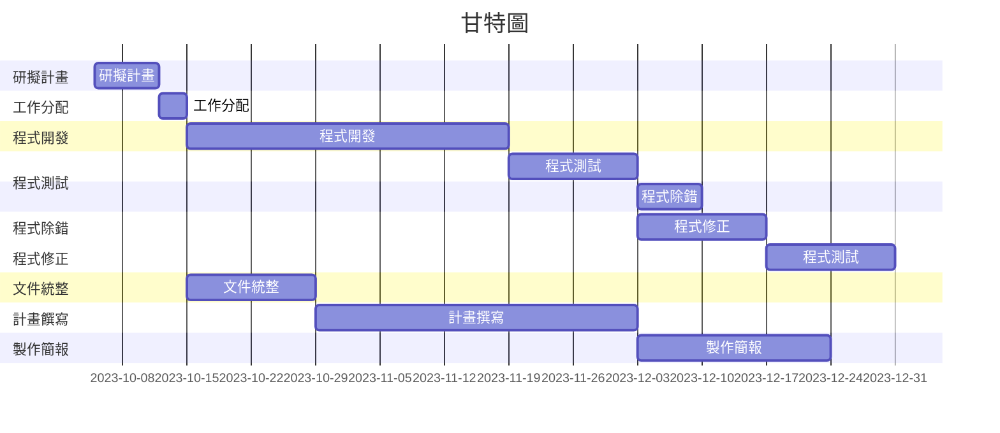

# 專題名稱
# discord機器人
# 小組成員 (組長)
|職位|學號|名字|
|:--:|:--:|:--:|
|組長|C110118217|林盛凱|
|組員|C110118201|謝政斈|
|組員|C110118207|葉力誠|
|組員|C110118243|陳以嘉|
|組員|C110118228|陳逸凱|

# 專題簡介 (300字以上)

# 工作任務

| 姓名 | 工作內容 |
| :-: | :-: |
| 葉力誠 | 程式開發及撰寫 |
| 謝政斈 | 程式開發及撰寫 |
| 陳逸凱 | 規劃目標及撰寫計畫書 |
| 陳以嘉 | 文件整理和統整 |
| 林盛凱 | 軟體測試並除錯 |

# 專題甘特圖與PERT/CPM圖

