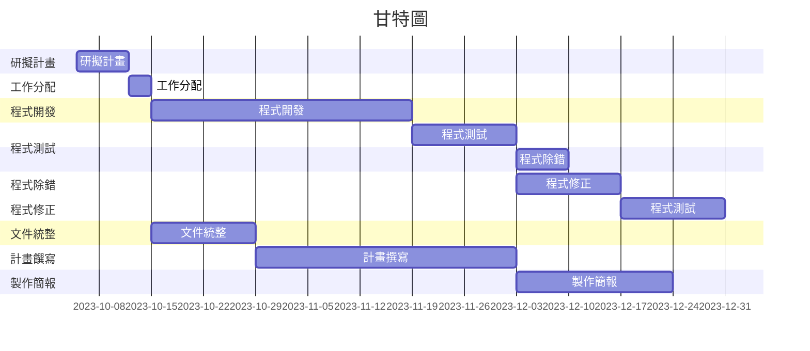
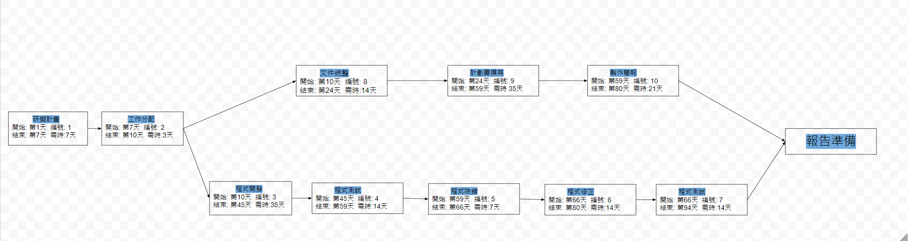
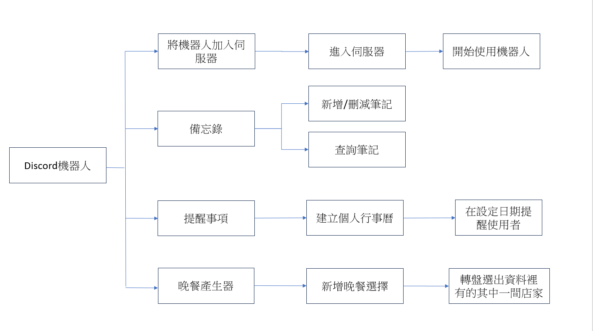
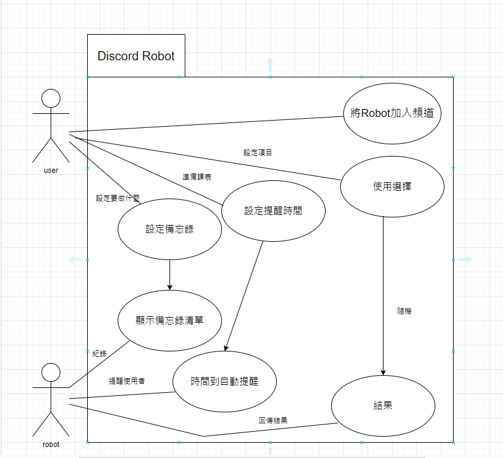
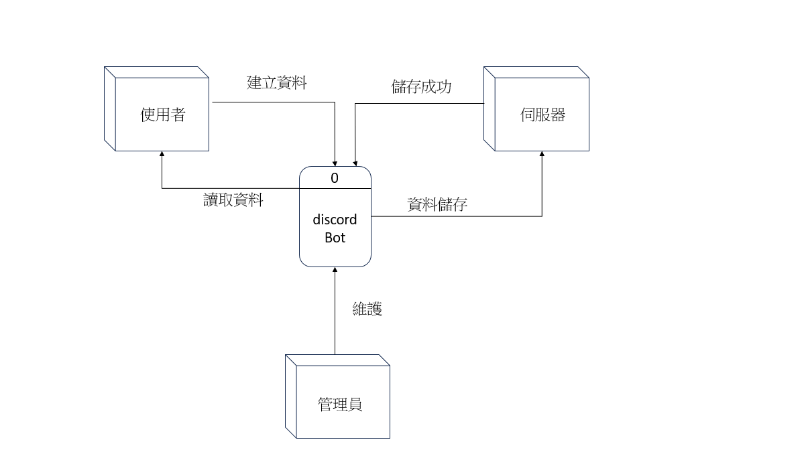
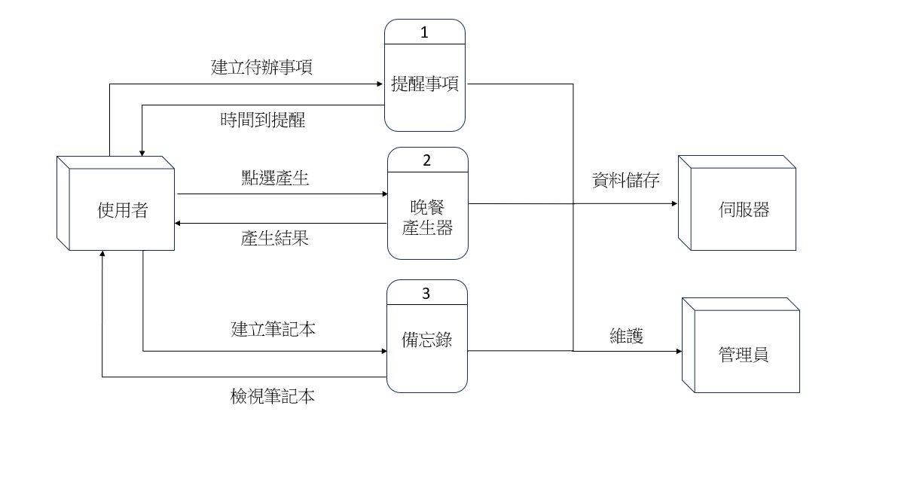

# 專題名稱 : discord機器人(第3組)
# 小組成員 (組長)
|職位|學號|名字|
|:--:|:--:|:--:|
|組長|C110118217|林盛凱|
|組員|C110118201|謝政斈|
|組員|C110118207|葉力誠|
|組員|C110118243|陳以嘉|
|組員|C110118228|陳逸凱|

# 專題簡介 (300字以上)
##Discord機器人製作是一個引人入勝的主題，這個專題旨在探討如何設計、開發和定制您自己的Discord機器人，以滿足各種不同需求和用途。Discord是一個廣泛使用的即時通訊平台，特別在遊戲社區和虛擬聚會中非常受歡迎。機器人的加入為這個平台帶來了更多的互動性、功能和樂趣，因此掌握如何創建和定制機器人是一個令人興奮的技能。

在這個專題中，我們將深入探討Discord機器人的製作過程，包括以下關鍵內容：

機器人的基本概念： 我們將解釋什麼是Discord機器人，以及它們如何在Discord伺服器中發揮作用。您將了解機器人的基本結構和功能，以及如何設計機器人以滿足您的需求。

開發工具和環境： 我們將介紹您需要的開發工具，包括程式語言選擇（通常使用Python、JavaScript等）、Discord API文檔的使用，以及如何設置開發環境。

創建您的機器人： 我們將逐步創建自己的Discord機器人。從註冊機器人帳號、獲取API金鑰，到編寫機器人的代碼。

功能和應用： 我們將討論不同種類的Discord機器人，包括娛樂性機器人、管理機器人、音樂機器人等。您將了解如何為這些機器人添加各種功能，並瞭解它們在不同情境中的應用。

部署和維護： 我們將解釋如何將您的機器人部署到Discord伺服器，以及如何維護和更新機器人以確保其順利運行。

安全性考慮： 我們將討論有關機器人安全性的重要考慮，以確保您的機器人不會受到濫用或遭受攻擊。

# 工作任務

| 姓名 | 工作內容 |
| :-: | :-: |
| 葉力誠 | 程式開發及撰寫 |
| 謝政斈 | 程式開發及撰寫 |
| 陳逸凱 | 規劃目標及撰寫計畫書 |
| 陳以嘉 | 文件整理和統整 |
| 林盛凱 | 軟體測試並除錯 |

# 專題甘特圖與PERT/CPM圖

# 關鍵路徑
1->2->3->4->5->6->7

# 功能性需求/非功能性需求
|功能性需求||
|:--:|:--:|
|1.提醒事項|可自行建立行事曆並在前一天提醒要完成甚麼事情|
|2.晚餐產生器|當你不知道晚餐要吃甚麼時使用這項功能會隨機出一個店家解決你的困擾|
|3.備忘錄|使用者將自己的筆記寫入備忘錄功能裡|

|非功能性需求||
|:--:|:--:|
|1.易用性|任何人能都可以在平台上做使用|
|2.可擴展性|使用者可以自行添加資料內容進去|
|3.可攜性|方便跨平台做使用，可以在不同裝置及作業系統上使用|

# 功能分解圖

# 需求分析的文字描述
1. 使用者指定提醒的內容，例如活動、約會、工作任務等。
2. 提醒可以是單次性的，也可以是週期性的，例如每天、每週或每月。
3. 提醒通過指令或訊息進行設定、查詢、刪除和編輯。
4. 使用者可以使用晚餐生產器來決定要吃什麼。
5. 備忘錄功能允許使用者存儲重要訊息、筆記或代辦事項。
6. 使用者添加、查看、編輯和刪除備忘錄條目。
7. 備忘錄能夠分類或標記，以方便組織和查找。
8. 使用者透過特定指令或訊息與機器人互動，以管理他們的備忘錄。 

# 使用案例圖

# 使用案例說明

|使用案例名稱|機器人使用|
|:---------:|:-------:|
|行動者|使用者|
|說明|描述機器人使用方式|
|完成動作|1.顯示備忘錄清單 2.時間到自動提醒 3.選擇結果|
|替代方法|1.將要記的項目用指令輸入資料庫 2.用指令設定需要提醒的時間 3.用指令輸入你要隨機的項目|
|先決條件|先填寫資料|
|後置條件|用指令輸入好你的需求|
|假設|無|

# 使用Figma劃出第一個使用案例的動態模擬畫面

https://www.figma.com/proto/VpiOS344NTp0U0bO2etSie/Untitled?type=design&node-id=2-15&t=BOHPzLHzFGMuSLtf-1&scaling=scale-down&page-id=0%3A1&starting-point-node-id=2%3A15&show-proto-sidebar=1&mode=design

# 系統環境圖 (DFD)

# DFD 圖0

# UML類別圖

# 循序圖與活動圖

# 使用案例一

# 使用案例二

# 使用案例三

